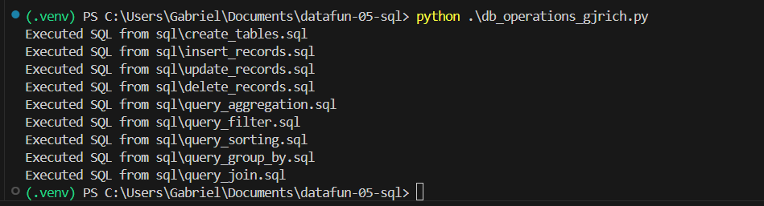
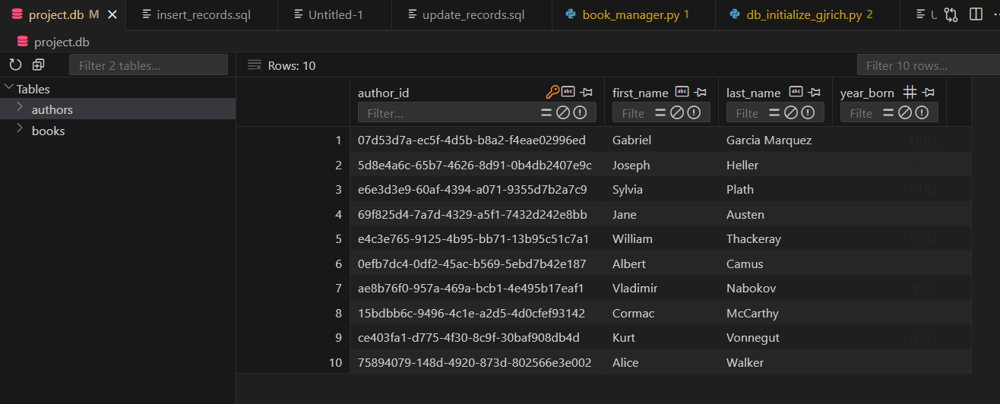

# datafun-05-sql

This project is created to bridge the use of Python with SQL.

THe Schema is designed with two tables in the file project.db. 
This SQL database is created from the authors.csv and books.csv
The books table has a foreign key constraint on the authors table via the author_id key.

To be explicit: the author names are not included in the books table
Only an author_id is, which corresponds to an author name on the authors table.

Basic logging is included. 
This documents when each function is run as well as the beginning and end.
The Create tables function which runs create_tables.sql also has exception logging added.

In order to use this repository:
1. Clone it to your machine with git into the desired directory:
git clone https://github.com/gjrich/datafun-05-sql/

2. From a Terminal, Enter the Python virtual environment
.\.venv\Scripts\activate

3. From the terminal, Install the required packages
py -m pip install -r requirements.txt

4. From a terminal, Initialize the database
python .\db_initialize_gjrich.py

5. From a terminal, Run the sql/*.sql scripts by running the operations script
python .\db_operations_gjrich.py

6. Validate the changes performed on project.db. This will require a tool that can view a SQL database (SQL Workbench or Sqlviewer in VSCode)

Here are a couple of example images demonstrating it working

The normal output on the commandline when running the operations script and causing the individual .sql scripts to run.

This second example displays what you can see after the operations script has run on the projects.db file successfully. As proof, you can see the Bell Jar by Sylvia Plath, which is inserted by insert_records.sql, has been replaced by George Orwell's Animal Farm from update_records.sql
